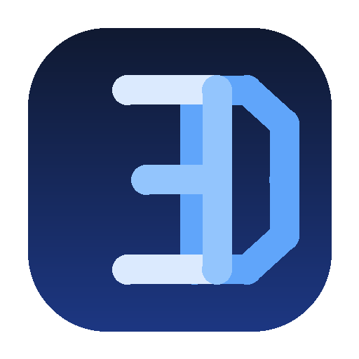

# ED Energy Component Scan

Door [Embedded Design](https://www.embedded-design.nl) — systemen, data en AI op een lijn.

Home Assistant custom-integratie die:

1. **Bekende apparaten** uitleest uit HA's eigen device registry (merk, model, via welke HA-integratie).
2. **Onbekende apparaten** lokaal opspoort via de ARP-tabel + een statische MAC-OUI-vendortabel (geen netwerkscans, geen IP-adressen worden verstuurd).
3. Het resultaat elke 6 uur (en direct na installatie, of via de `ed_energy_scan.scan_now`-service) post naar de [embedded-design.nl](https://www.embedded-design.nl) catalogus-cloud, waar je het kunt reviewen op `/#/energie/home-assistant/apparaten`.

## Installatie

1. Log in op [embedded-design.nl/#/energie/home-assistant](https://www.embedded-design.nl/#/energie/home-assistant) en maak een pairing-token aan.
2. Voeg `https://github.com/ed2026-energy/ha-ed-energy-components-scan` toe als custom repository in HACS (categorie: Integration).
3. Installeer "ED Energy Component Scan", herstart Home Assistant.
4. Instellingen → Apparaten & Services → Integratie toevoegen → "ED Energy Component Scan" → plak het pairing-token.

## Privacy

Er wordt nooit een IP-adres, adresgegeven of volledig MAC-adres verstuurd — alleen merk/model/HA-integratienaam (bekende apparaten) of een vendornaam + verkorte identificatie (onbekende apparaten). Zie de privacytekst op de website voor het volledige overzicht.
